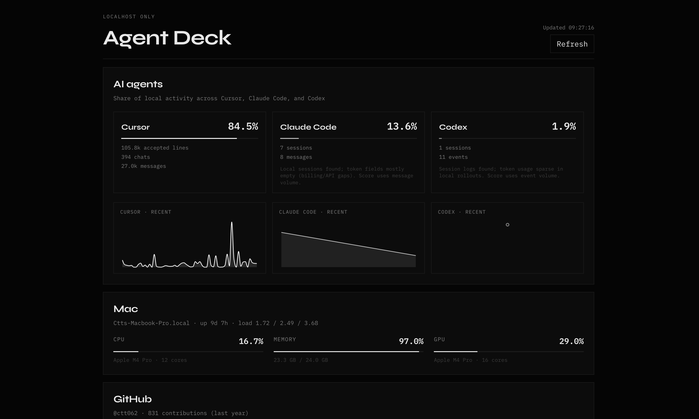

# Agent Deck



Local macOS dashboard for AI agent usage (Cursor, Claude Code, Codex), Mac resource meters, and your GitHub contribution calendar.

Runs entirely on your machine. Nothing is uploaded.

  

## Why localhost (not a public web host)

Your machine is the source of truth:

- **Cursor** stats live in a local SQLite DB
- **Claude Code** / **Codex** sessions are local JSONL logs
- **CPU / GPU / Memory** only exist on this Mac
- **GitHub** calendar is fetched with your local `gh` auth

A remote host cannot see those safely. Keep the app on `127.0.0.1`. This GitHub repo is only the source code.

## Download

### Option A - Clone with Git

```bash
git clone https://github.com/ctt062/agent-dashboard.git
cd agent-dashboard
npm install
npm run dev
```

### Option B - ZIP download (no Git)

1. Open https://github.com/ctt062/agent-dashboard
2. Click **Code → Download ZIP**
3. Unzip, then in that folder:

```bash
npm install
npm run dev
```

Open **http://127.0.0.1:5174**

### Production-style start (optional)

```bash
npm install
npm run build
npm start
```

`npm start` serves the API on `http://127.0.0.1:3847`. For the UI, use `npm run preview` (or keep using `npm run dev`).

## Requirements

- **macOS** (system collector uses `top` / `ioreg`)
- **Node.js 22+** (uses built-in `node:sqlite`)
- **[GitHub CLI](https://cli.github.com/)** authenticated (`gh auth status`) for the contribution calendar
- Optional local data for agent panels:
  - Cursor installed (reads `~/Library/Application Support/Cursor/...`)
  - Claude Code logs under `~/.claude/projects/`
  - Codex sessions under `~/.codex/sessions/`

Missing collectors degrade gracefully - panels show empty or partial data instead of crashing.

## Stack

- Vite + React + TypeScript UI
- Express API on port `3847` (localhost only)
- Collectors read local files / `top` / `ioreg` / `gh api`

## What the percentages mean

Agent % is **relative share** of a local activity score across Cursor, Claude Code, and Codex on this Mac - not a vendor billing percentage.

| Agent | Primary signal |
|-------|----------------|
| Cursor | Accepted AI lines (`aiCodeTracking.dailyStats`) + chat volume |
| Claude Code | Tokens from `~/.claude/projects/**/*.jsonl`, else message volume |
| Codex | Tokens from `~/.codex/sessions/**/*.jsonl`, else event volume |

## API

Bound to `127.0.0.1` only:

| Endpoint | Description |
|----------|-------------|
| `GET /api/dashboard` | Full payload (agents + system + GitHub) |
| `GET /api/system` | Mac snapshot only |
| `GET /api/health` | Liveness check |

Override the API port with `PORT` if needed:

```bash
PORT=4000 npm run dev:api
```

## Privacy

- Nothing is uploaded by this app
- Do not expose port `3847` beyond localhost
- Stats come from files and tools already on your Mac

## License

MIT - see [LICENSE](./LICENSE).
